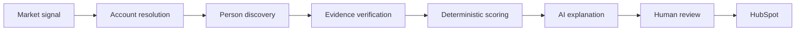
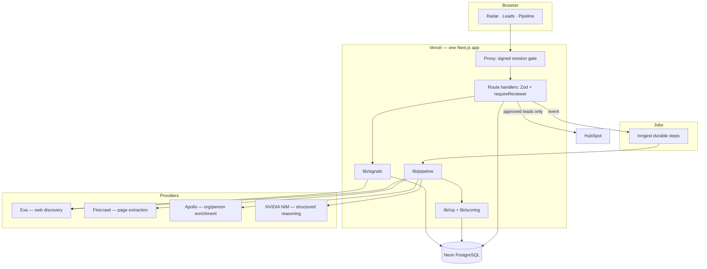

# GeneralMind GTM Radar

**An evidence-backed GTM intelligence system that turns market signals into reviewable account and contact opportunities.**

The case-study implementation starts with **events**, but the underlying system is built around **signals**: hiring, executive changes, ERP transformations, expansion and operational initiatives feed the same account-intelligence engine as conference participation.

|  |  |
| --- | --- |
| **Live demo** | https://generalmind-gtm-radar.vercel.app *(reviewer access is password-gated because the app triggers paid data-provider calls and CRM writes; credentials are shared privately)* |
| **Repository** | https://github.com/chetas1208/GeneralMind_GTM |
| **Stack** | Next.js · TypeScript · Tailwind · shadcn/ui · Neon Postgres · Drizzle · Exa · Firecrawl · Apollo · NVIDIA NIM · HubSpot · Inngest · Vercel |

---

## The problem

GeneralMind automates the messy coordination layer *between* email/documents and systems like ERP/CRM across procurement, supply chain, finance and order operations. The accounts that benefit are operationally complex enterprises — and the moments they are most receptive are visible in public: a new VP Procurement, an SAP programme, a new distribution centre, a speaking slot at a supply-chain conference.

Finding those moments by hand doesn't scale. Naively scraping them does worse: it produces confident-looking lists of people who aren't actually going anywhere, and a sales team that stops trusting the tool.

## The case-study requirement

> 1. Find 10 upcoming events relevant to GeneralMind.
> 2. Source relevant leads associated with those events.
> 3. Provide an interface for review.
> 4. Conceptualize (and lay the foundation for) a broader lead-generation system.
> 5. Push approved leads to HubSpot.

| Requirement | Where it lives |
| --- | --- |
| Find 10 relevant events | **Radar** – `Discover events` (Exa) → deterministic relevance score → top 10 promoted (`lib/intelligence/events`) |
| Source leads per event | **Source leads** – durable pipeline: companies → people → evidence → enrichment → scoring (`lib/pipeline`) |
| Review interface | **Leads** + lead detail: score breakdown, evidence, approve/reject, notes (`app/leads`, `components/leads`) |
| Broader lead-gen system | **Universal signal engine**: events are one `SignalAdapter` among six (`lib/signals`) |
| Push to HubSpot | Human-gated, idempotent company + contact upsert and association (`lib/integrations/hubspot`) |

## What I built

- A **durable sourcing pipeline** (Inngest steps with cursors and leases) that never loses work when a provider times out.
- A **deterministic scoring model**: the LLM never produces a number.
- An **evidence/provenance model** where every claim traces to a stored source snippet and URL.
- A **signal engine** with adapters, verification, freshness decay, de-duplication, stacking, clustering and an inspectable account priority.
- A **human-review workflow** with an enforced status state machine, and a **HubSpot sync** that cannot run on unapproved leads.
- A minimal, authenticated **cockpit** (Radar · Leads · Pipeline) designed for a reviewer, not an engineer.

## Core workflow



Plain-text version: `SIGNAL → ACCOUNT → PERSON → EVIDENCE → OPPORTUNITY → PRIORITY → HUMAN REVIEW → CRM`.

## Product surfaces

| Surface | Purpose |
| --- | --- |
| **Radar** (`/radar`) | Market signal radar: top opportunities by account priority, upcoming events, recent signals, *Refresh intelligence*. |
| **Leads** (`/leads`) | Review queue with search and filters (event, persona, industry, score, attendance). Lead detail shows the score breakdown, attendance statement, evidence, notes and approve / reject / push-to-CRM. |
| **Pipeline** (`/pipeline`) | Leads by review state and live run activity. |
| Account (`/accounts/[id]`) | Fit and priority, *why now*, signal timeline, likely workflows, relevant people. Opened from Radar, Leads and search. |
| Event (`/events/[id]`) | Why the event matters, participants, companies, source evidence. |
| `/system` | Developer diagnostics: integration health and signal-engine counters. Not in the main navigation. |

Provider names (Exa, Firecrawl, …) are intentionally absent from the product UI.

## Architecture



**One repository, one Next.js application, one Vercel project.** No Python, no separate backend, no microservices, no graph database, no GitHub Actions, no Vercel Cron.

## Technology stack

| Function | Technology |
| --- | --- |
| Full-stack application | Next.js (App Router) + TypeScript (strict) |
| UI | Tailwind CSS + shadcn/ui |
| Database | Neon PostgreSQL (serverless driver) |
| ORM / migrations | Drizzle ORM + drizzle-kit |
| Search / discovery | Exa |
| Page extraction | Firecrawl |
| Enrichment | Apollo |
| AI reasoning | NVIDIA Build / NIM (OpenAI-compatible, Nemotron) |
| Background jobs | Inngest (durable, retried steps) |
| CRM | HubSpot |
| Validation | Zod |
| Hosting | Vercel |

**Provider roles.** Exa discovers events, companies and signals on the open web. Firecrawl renders and extracts pages worth reading in depth. Apollo enriches organisations (and people, when the plan includes People Search/Match). NVIDIA produces *categorical* judgements and concise explanations after the score is final. Neon is the system of record. HubSpot is the downstream destination, reached only after human approval.

> **Numerical scoring is deterministic TypeScript, not generated by the LLM.** Model output is Zod-validated; one repair retry, then the item is marked failed and the run continues.

## Intelligence pipeline

Progressive research — cheap steps first, expensive steps only for survivors:

```
Level 0  cheap search result
Level 1  verify the primary source
Level 2  resolve the account
Level 3  classify workflow relevance
Level 4  find the buyer (Apollo when the plan allows it; otherwise event evidence + verified public profiles)
Level 5  deep opportunity synthesis (AI explanation, last)
```

Writes are upserts on canonical keys (domain, normalised name, LinkedIn URL, evidence hash). A database lease allows a single worker per run, and starting a run for an event that already has one returns the active run. Failed or cancelled runs resume from a saved cursor.

## Event intelligence

Events are a rich entity: records, evidence, event↔company and event↔person relationships, attendance confidence and their own UI are all preserved. Event relevance is a deterministic score computed from categorical ratings. Events remain a *major* signal type because they combine timing, persona, account, intent and physical availability.

## Universal signal engine

`lib/signals/` generalises event intelligence into a reusable primitive. A **signal** is a verified external observation that may change the probability a company has a relevant GeneralMind problem, budget, urgency, organisational change or reachable buyer. Signals are evidence-backed — never LLM opinions.

```ts
interface SignalAdapter {
  id: string;
  discover(input): Promise<SignalCandidate[]>;
  verify(candidate, input): Promise<VerifiedSignal | null>;
}
```

| Adapter | What it looks for |
| --- | --- |
| `event` | Conference participation, wrapping the existing event graph. |
| `hiring` | Specific roles in procurement, supply chain, order management, AP, SAP/ERP, transformation. |
| `erp` | S/4HANA, Oracle, Dynamics, modernisation — classified as announced / underway / completed. |
| `executive` | CPO / COO / CIO / VP Procurement / VP Supply Chain appointments. |
| `expansion` | New plants, distribution centres, warehouses, capacity. |
| `operations` | Procurement / supply-chain / finance transformation programmes, plus *negative* evidence such as touchless AP. |

Downstream code does not care whether a signal came from a conference or a job posting.

**Pipeline:** discover → normalise → verify → classify → persist → cluster → account intelligence.

**Design rules that keep it credible**

- **Fact / inference / relevance are separate.** "Acme posted a Director of Procurement Transformation" is a fact; "procurement transformation is receiving investment" is an inference; GeneralMind relevance is a hypothesis. Expansion and M&A are never stated as pain.
- **Confidence ≠ relevance ≠ urgency.** A confirmed new warehouse can be 99 confidence and 55 relevance.
- **Direction.** Signals are `positive`, `neutral` or `negative` (e.g. an already-touchless AP process lowers *that workflow*, not necessarily the account).
- **Freshness decay is per type.** Events are strong until they happen; executive changes are strong for ~90 days; hiring decays over weeks; ERP is long-lived but stage-sensitive. History is kept; only active signals dominate.
- **Stacking is bounded.** Priority rewards *independent, aligned* signals of different types. Syndicated copies of one announcement, or several articles on one story, never count twice (de-dup key plus a per-type cap).
- **Precision over recall.** Verification requires the claim to sit within a few hundred characters of a whole-word company mention, rejects look-alike domains (a consultancy named `<Company> Consulting`), personal profiles, webinars and careers landing pages, and demands a date where staleness matters.
- **Primary sources outrank coverage.** Company-domain evidence receives higher confidence than third-party articles.
- **Funding is low-weight by default.**

## ICP and scoring

### Lead score — `icp-v2`, 100 points (`lib/icp`, `lib/scoring`)

| Section | Max | Inputs |
| --- | --- | --- |
| Company fit | 40 | Industry, size, operational complexity, ERP/workflow signals, geography |
| Persona fit | 30 | Function and seniority against GeneralMind's buyer personas |
| Event intent | 30 | Attendance evidence, corroboration, event relevance |

Leads ≥ 55 enter the review queue. Every factor stores its points and a note, so the UI can show exactly why a lead scored what it did. The scoring version is persisted with the score.

**Priority** (0–100) is separate from fit: it adds event proximity, attendance confidence, contact route (work email +5, verified public profile +3) and multi-event frequency, so a slightly weaker lead at an imminent conference can outrank a perfect-fit lead with nothing happening.

### Account priority (`lib/signals/scoring.ts`)

| Component | Max |
| --- | --- |
| Account fit | 30 |
| Persona fit | 20 |
| Signal strength (freshness-decayed) | 20 |
| Evidence confidence | 10 |
| Urgency | 10 |
| Aligned-signal stacking | 5 |
| Contactability | 5 |

Negative signals subtract. The breakdown is stored on the account and rendered so *"why is this 69?"* is answerable line by line.

## Evidence + provenance

Provenance chain (non-negotiable):

```
OPPORTUNITY → SIGNAL CLUSTER → SIGNAL → EVIDENCE → SOURCE URL
```

- Evidence is **built by code**: names must literally appear in the retrieved text; snippets are cut from that text, hashed for de-duplication and stored with URL and retrieval time.
- Public role claims need a verbatim quote that is re-verified against the page.
- **The system never claims attendance without supporting evidence.** The attendance ladder is explicit and drives both score and wording:

| Attendance type | Confidence | Wording in the UI |
| --- | --- | --- |
| Official speaker | 98 | Confirmed speaker |
| Organizer | 95 | Event organizer |
| Public attendance statement | 90 | Public attendance statement |
| Exhibitor / sponsor / partner employee | 50–60 | "…personal attendance not confirmed" |
| Company participating | 40 | "…person not confirmed" |
| Inferred | 25 | Weak inference |

Only a speaker page, agenda, attendee statement or personal announcement can say someone is attending. A post-generation guard rewrites any unsupported attendance claim.

## Human review

Review is a server-enforced state machine (`lib/services/transitions.ts`):

```
discovered → qualified → needs_review → approved → hubspot_synced
                              │             │
                              └→ rejected ←─┘      rejected → approved   (explicit reconsideration only)
```

- Approve and reject are only legal from reviewable states; a synced lead is final.
- A rejected lead can **never** reach HubSpot without being re-approved.
- Rejection reasons are preserved (`not_icp`, `wrong_persona`, `weak_evidence`, `already_in_crm`, `bad_timing`, `other`) so review data can later show which signals, workflows and personas get approved. No ML is trained yet.
- Manual edits (title, email) are audited and outrank enrichment.

## HubSpot integration

`lead.status === approved` **and** the latest review decision being *approve* are required. Sync is idempotent:

1. Find company by domain → create or update.
2. Find contact by email → create or update.
3. Associate contact ↔ company.
4. Persist HubSpot IDs, mark `hubspot_synced`, write an audit entry.

Repeating a sync returns `already_synced`. Concurrent attempts are blocked while one is in flight. Missing email, missing domain, rate limits, invalid tokens and HubSpot property validation errors surface as real errors — never faked success.

## Data model

Drizzle schema in `lib/db/schema.ts`; migrations in `db/migrations`.

| Table | Purpose |
| --- | --- |
| `events`, `event_sources` | Events and the pages that support them |
| `companies`, `people` | Accounts (with fit, `account_priority`, `account_intelligence`) and contacts |
| `event_companies` | Event↔company relationships with association type and confidence |
| `event_leads` | Opportunity per (event, person): scores, attendance, priority, status |
| `lead_evidence` | Stored evidence snippets with URL, hash, retrieval time |
| `signals`, `signal_clusters` | Universal signals (type, direction, confidence/relevance/urgency, dedupe key) and per-workflow clusters |
| `review_actions` | Audit trail of approve / reject / edit / push |
| `hubspot_syncs` | Sync attempts, HubSpot IDs, errors |
| `source_runs` | Durable run state: cursor, counters, activity log, lease |

## Security

| Control | Implementation |
| --- | --- |
| Authentication | Shared reviewer password → **signed, expiring session cookie** (`httpOnly`, `secure` in production, `sameSite=lax`, 7-day TTL). Sign-out supported. |
| Fail closed | Without both `APP_ACCESS_PASSWORD` and `AUTH_SECRET`, production returns 503; it never falls open. Local dev without them is open. |
| Authorization | The proxy gates every page and API route; **every mutation re-checks the session inside the handler** (`requireReviewer`). Hiding buttons is never the control. |
| Protected actions | Source events, discover events, refresh intelligence, approve / reject, edit notes, push to CRM, cancel / retry runs, create / update events. |
| Input validation | Zod on bodies and params; UUID checks on route params; status transitions enforced server-side. |
| Abuse protection | Authenticated access, run-state locks, duplicate-run protection, a 10-minute per-account refresh cooldown, bounded batch size. |
| Secrets | Server-side only; `NEXT_PUBLIC_*` holds the public site URL and nothing else. Logs redact key patterns. `.env*` is git-ignored. |
| Scraped content | Never rendered as HTML. External links are validated to `http(s)` and use `rel="noopener noreferrer"`. |
| Headers | `X-Content-Type-Options`, `Referrer-Policy`, `X-Frame-Options`/`frame-ancestors`, `Permissions-Policy`, HSTS. |
| Inngest | `/api/inngest` verifies request signatures with `INNGEST_SIGNING_KEY`. |

## Repository structure

```
app/                     Next.js routes, pages and API route handlers
  api/                   Mutations and reads (Zod + requireReviewer)
  accounts/ events/ leads/ pipeline/ radar/ system/
components/              Cockpit UI (shell, radar, leads, accounts, pipeline) + shadcn/ui
lib/
  access.ts auth.ts      Session signing/verification and server-side authorization
  ai/                    Provider-agnostic LLM client, prompts, Zod schemas
  db/                    Neon + Drizzle schema and queries
  icp/                   GeneralMind ICP: industries, personas, workflows, company/persona/intent fit
  scoring/               Deterministic lead and event scoring
  intelligence/          Event selection, lead priority, provenance helpers
  signals/               Universal signal engine: adapters, verify, freshness, scoring, clusters
  pipeline/              Sourcing / discovery stages and the run state machine
  inngest/               Durable functions, events, dispatch
  integrations/          Exa, Firecrawl, Apollo, HubSpot adapters + health checks
  services/              Review workflow, status transitions
db/migrations/           Drizzle SQL migrations
scripts/                 Backfills and Vercel env sync
tests/                   Vitest suites (scoring, ICP, signals, security, HubSpot, run loop)
proxy.ts                 Access gate (Next.js proxy)
```

## Environment variables

Copy `.env.example`. **Never commit real values**, and do not quote them.

| Variable | Required | Notes |
| --- | --- | --- |
| `DATABASE_URL` | yes | Neon connection string (use the pooled host) |
| `EXA_API_KEY`, `FIRECRAWL_API_KEY`, `APOLLO_API_KEY` | for live sourcing | Server-only |
| `NVIDIA_API_KEY`, `MODEL_BASE_URL`, `MODEL_NAME` | for explanations | Defaults to NVIDIA `nvidia/nemotron-3-ultra-550b-a55b` |
| `HUBSPOT_ACCESS_TOKEN` | for CRM push | Private-app token with contacts + companies read/write |
| `INNGEST_EVENT_KEY`, `INNGEST_SIGNING_KEY` | production jobs | From the Inngest dashboard. Local: `INNGEST_DEV=1` |
| `APP_ACCESS_PASSWORD` | **production** | Shared reviewer password |
| `AUTH_SECRET` | **production** | ≥ 32 random chars (`openssl rand -base64 32`); signs sessions |
| `NEXT_PUBLIC_APP_URL` | yes | Public site URL — the only `NEXT_PUBLIC_*` value |
| `MAX_*`, `TOP_EVENTS_LIMIT` | no | Cost / breadth budgets |

## Local development

Requirements: Node 22+, pnpm.

```bash
git clone https://github.com/chetas1208/GeneralMind_GTM.git
cd GeneralMind_GTM

pnpm install
cp .env.example .env.local     # fill in your own values
pnpm db:migrate                # applies db/migrations to DATABASE_URL
pnpm dev                       # http://localhost:3000
pnpm inngest:dev               # second terminal; requires INNGEST_DEV=1
```

Without `APP_ACCESS_PASSWORD`/`AUTH_SECRET`, local development is open. Set both to exercise the login flow.

```bash
pnpm lint && pnpm typecheck && pnpm test && pnpm build
```

Optional: backfill event signals from an existing event graph — `pnpm exec tsx scripts/backfill-signal-events.ts`.

## Database migrations

- Schema source of truth: `lib/db/schema.ts`.
- Create a migration after changing it: `pnpm db:generate`.
- Apply migrations: `pnpm db:migrate` (reads `DATABASE_URL`).
- Migrations are **not** run automatically by Vercel. Run `pnpm db:migrate` against the production database *before* deploying a schema change. A fresh database migrates cleanly from `0000`.

## Production deployment

1. **Import** the GitHub repository in Vercel (framework preset: Next.js; defaults for install/build).
2. **Neon:** create a project, copy the pooled connection string into `DATABASE_URL`, then run `pnpm db:migrate` against it.
3. **Environment variables:** add every variable above to *Production* (Project → Settings → Environment Variables). Use `node scripts/sync-vercel-env.mjs` to push a local `.env.local` safely. Do not set `INNGEST_DEV`. Set `NEXT_PUBLIC_APP_URL` to the production URL.
4. **Preview deployments** deliberately receive no production secrets; without auth config they fail closed with 503.
5. **Deploy.** Environment-variable changes require a redeploy.
6. **Inngest:** sync `https://<your-domain>/api/inngest` (dashboard or Vercel integration).
7. **Verify:** sign in → `/radar`, `/leads`, `/pipeline` → one lead detail → `/system` for integration health.

## API / integration behaviour

### Contact routes without a paid people-data provider

When Apollo People data is unavailable, a lead's outreach route is a **verified public profile**. A profile is attached only if every check is deterministic code, not a model's opinion:

1. **Name gate** — the search-result title and the on-page header must both match the person (German forms like Jörg/Joerg/Jorg are equivalent; "Jane" never matches "Janet").
2. **Employer gate** — the page must name the lead's company as whole words.
3. **Current-role proof**, first one that applies:
   - the profile **headline** names the employer (and is not "former"/"ex-"), or
   - the **Experience section** lists a role at that employer marked *Current/Present*, or
   - fallback: an LLM reads the page, and its quote must be verbatim **and** itself name the employer.
4. The evidence stores the page's own text (never a paraphrase), labelled *self-published, not independently verified*.

Verified profiles flow to HubSpot as `hs_linkedin_url` (https LinkedIn `/in/` URLs only). Work emails are never inferred or pattern-guessed. A lead page shows the route, or an honest "Not found yet" with a *Find verified profile* action (`POST /api/leads/:id/contact-route`, reviewer-only). Contactability contributes 5 account-priority points for an email and 3 for a verified profile.

- Provider failures are isolated: if one signal adapter fails the others still run; if Apollo people search is unavailable the pipeline switches to the verified-profile route above and `/system` reports Apollo as degraded.
- Retries: 429 / 5xx / timeouts retry the failed *step* with backoff; auth, config and validation errors are non-retriable and fail the run with the real message.
- Errors shown to users are meaningful and sanitised; technical detail is logged server-side with secrets redacted.

## Known limitations

- **Public attendee data is incomplete.** Company participation does not imply individual attendance; the UI says so.
- **No work emails without a people-data provider.** Apollo People Search/Match need a paid plan. Without it the system still works end to end: companies are enriched, buyers come from event evidence and public profiles, and each lead gets a *verified public profile* as its outreach route (see below). Emails stay empty rather than guessed; a reviewer can add one by hand and it outranks everything else.
- **Some pages block automated extraction**; those sources are skipped, not guessed.
- **Signal quality depends on public evidence.** Heuristic verification is deliberately conservative and will miss weak signals. Two articles about one development can still survive as two signals if their wording differs.
- **Opportunity** is modelled as event leads plus account intelligence; there is no separate `opportunities` table yet.
- **"Why GeneralMind" / discovery angle** on accounts are currently deterministic templates; evidence-ID-grounded model synthesis is designed but not wired in.
- **No M&A or technology-adoption adapter** beyond negative-automation detection.
- **No scheduled refresh.** Everything is user-triggered; scheduling belongs in Inngest, not Vercel Cron.
- **Single reviewer role** with a shared password — appropriate for a case-study deployment, not multi-tenant production.

## Future architecture

- Evidence-ID-grounded synthesis for *why now / why GeneralMind / discovery angle*, rejecting unknown IDs.
- Persona ranking driven by the dominant signal and workflow, and buyer pairs (operational + technical).
- Workflow-specific fit (strong P2P, weak O2C) rather than one account number.
- A learning loop over review outcomes (which signals, workflows, personas and industries get approved).
- Saved ICP profiles and a bounded broad-account-discovery pathway.
- Inngest-scheduled daily refresh with budgets.

## Why this architecture

- **Signals, not events,** are the reusable primitive; events are simply the first adapter, so adding hiring or ERP detection didn't touch the scoring engine.
- **Deterministic numbers, model prose.** Scores are reproducible and explainable; the model can only add words after the fact.
- **Evidence first.** If a claim can't be traced to stored text and a URL, it doesn't ship as a claim.
- **Cheap before expensive.** Search → qualify → enrich → explain keeps provider spend proportional to value.
- **Human in the loop at the only irreversible step** — writing to the CRM.
- **One deployable.** A single Next.js app on Vercel with Neon keeps the operational surface small enough to reason about.
